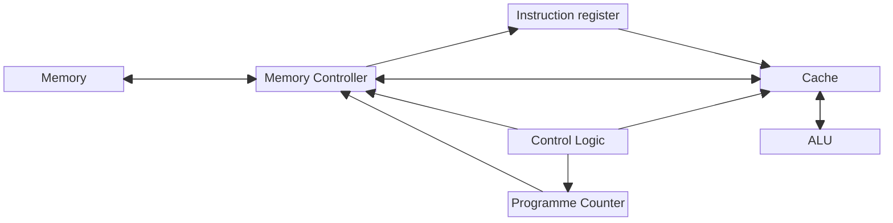

# TRC
The project aims to create a **T**iny **R**ISC **C**PU with a custom instruction set.

## CPU architecture 

It's a very simple CPU who works in one cycle per instruction. So it doesn't have a lot of elements, the goal is to by asap.



## Instruction set
Inspired by the RISC-V instruction set presented by [DZone](https://dzone.com/articles/introduction-to-the-risc-v-architecture), I keep just the minimum, it's a lite bit less than the RV32I. It's also structure differently.

``` text
_________________________________________________________
|31         24|23         16|15          8|7           0|
| Instruction | Destination | Source      | Complement  |
|_____________|_____________|_____________|_____________| 
```

It's needed 16 registers :
| Register   | Function                                        |
| ---------- | ----------------------------------------------- |
| r0         | '0' value, it does nothing when we write in it. |
| r1  to r14 | Store data.                                     |
| r15        | Direct access to the complement value           |

In the following table, I will present my instruction set. For better notation, I use C notation, so r1 is the address and *r1 is the value at the address. For direct value, we use xff with ff the hex value we want. It's important to know than all value is considered as signed integer. 
| Instruction name | Binary equivalent | Description                                                                                                                       | Example                                        |
| ---------------- | ----------------- | --------------------------------------------------------------------------------------------------------------------------------- | ---------------------------------------------- |
| `add`            | 0x01              | Add the value of the register give by the source and the complement and save the result in the destination register.              | add r3, r1, r2 => *r3 = *r1 + *r2              |
| `addi`           | 0x02              | Add the value of the register give by the source and the value of the complement and save the result in the destination register. | addi r3, r1, xff => *r3 = *r1 + *r2            |
| `sub`            | 0x03              | Same as the `add` but with a subtraction.                                                                                         | sub r3, r1, r2 => *r3 = *r1 - *r2              |
| `sll`            | 0x04              | Logical bit shift to the left by the value in the register point by the complement.                                               | sll r3, r1, r2 => *r3 = *r1 << *r2             |
| `srl`            | 0x05              | Logical bit shift to the right by the value in the register point by the complement.                                              | srl r3, r1, r2 => *r3 = *r1 >> *r2             |
| `and`            | 0x06              | And operation between two numbers.                                                                                                | and r3, r1, r2 => *r3 = *r1 and *r2            |
| `or`             | 0x07              | Or operation between two numbers.                                                                                                 | or r3, r1, r2  => *r3 = *r1 or *r2             |
| `xor`            | 0x08              | Xor operation between two numbers.                                                                                                | xor r3, r1, r2 => *r3 = *r1 xor *r2            |
| `beq`            | 0x09              | If the source and the complement is equal, go two instructions after, if not, do the next instruction.                            | beq r0, r1, r2 => if *r1 == *r2 then _ else _; |
| `blt`            | 0x0a              | If the source is smallest than the complement, go two instructions after, if not, do the next instruction.                        | beq r0, r1, r2 => if *r1 < *r2 then _ else _;  |
| `jal`            | 0x0b              | Jump to new address and store the next address in a register.                                                                     | jal r1, r2, r0                                 |
| `lw`             | 0x0c              | Load the data from memory to registers. The memory address has to be store in the source register.                                | lw r2, r1, r0                                  |
| `sw`             | 0x0d              | Store the value of a register in memory at the address in the destination register.                                               | sw r2, r1, r0                                  |


**Tips** :
1. To set a value in the memory to a direct value we can do :
    ```asm
    # Store 0x2a in the memory at the address 0x17.
    add r1, r0, x2a
    add r2, r0, x17
    sw r2, r1, r0
    ```
2. To make a immediate subtraction `subi` we can just add a negative value.
3. To set a value greater than 0xff you can shift and add bits :
    ```asm
    # Store 0x12345678 in the register r1.
    add r1, r0, x12   # r1 = x00000012 / r2 = x?
    sll r2, r1, x08   # r1 = x00000012 / r2 = x00001200
    add r1, r2, x34   # r1 = x00001234 / r2 = x00001200
    sll r2, r1, x08   # r1 = x00001234 / r2 = x00123400
    add r1, r2, x56   # r1 = x00123456 / r2 = x00123400
    sll r2, r1, x08   # r1 = x00123456 / r2 = x12345600
    add r1, r2, x78   # r1 = x12345678 / r2 = x12345600
    ```
4. To move a value form a register to an other :
    ```asm
    # move r2 to r1
    add r1, r2, r0
5. To make a loop we can :
    ```asm
    addi r1, r0, x01  # line x00
    addi r2, r1, x01  # line x01
    add r1, r2, r0    # line x02
    jnl x01, r0, r0   " line x03
    ```

## Issues

1. TerosHDL made a weird indentation with `case` :
    ```VHDL
          when 6 => -- XOR
        result_value <= main_value xor second_value;
      when 7 => -- Equal
        result_value(0) <= '1' when (main_value = second_value) else
        '0';
        result_value(DATA_WIDTH - 1 downto 1) <= (others => '0');
      when 8                                           => -- Less than
        result_value(0) <= '1' when (main_value < second_value) else
        '0';
        result_value(DATA_WIDTH - 1 downto 1) <= (others => '0');
      when others                                      => -- Default
        result_value <= (others                          => '0');
    end case;
    ```
    It seems like it wants to align the "`=>`" of `when X =>` with the one of `(others => '0')`.